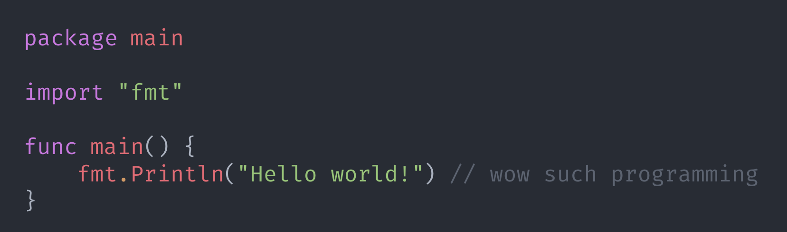

# Prism


[](https://goreportcard.com/report/github.com/mrmarble/prism)
[](https://pkg.go.dev/github.com/mrmarble/prism)

Create beautiful images of your source code directly from your terminal.



# Installation

Precompiled `prism` binaries can be found at [releases](https://github.com/mrmarble/prism/releases) page.

Instructions below show how to build `prism` from sources.

```sh
go install github.com/mrmarble/prism/cmd/prism@latest # or target a specific version @v0.1.0
```
# Usage
Be sure `prism` executable is under your `$PATH`.

Usage of **prism**: prism [input file] [args...] Run prism without arguments to get help output.

```
Flags:
  -h, --help                  Show context-sensitive help.
  -l, --lang=STRING           Language to parse.
  -o, --output="prism.png"    output image
      --version               Print version information and quit
  -n, --numbers               display line numbers
      --header                display header
```

## Supported languages

See [languages](tokenizer/languages/) for a list of implemented languages.